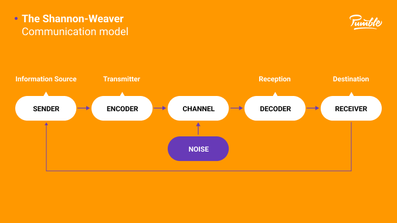
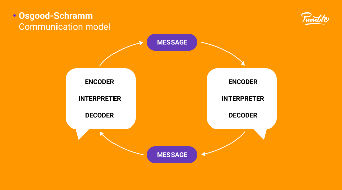
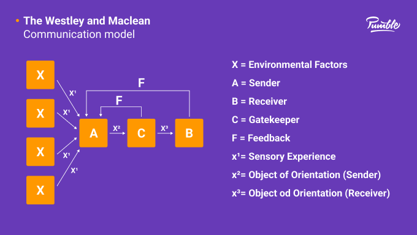
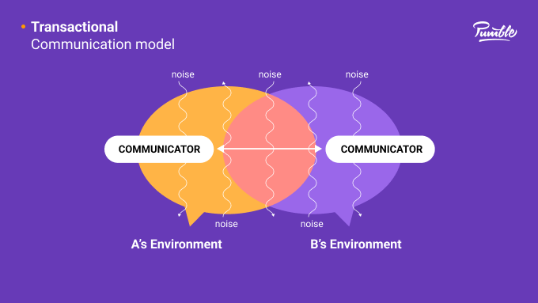
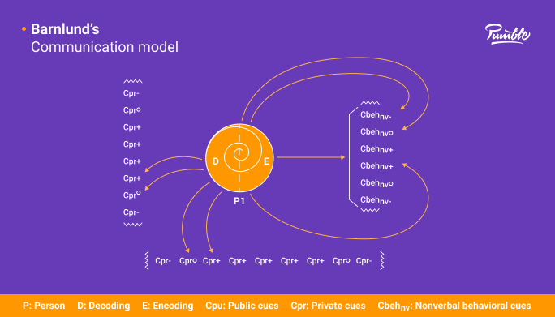

# Media Information Literacy

## What is Communication?

**Communication**  (from Latin: _commūnicāre_, meaning __"to share"__ or __"to be in relation with"__)

Communication is usually defined as the **transmission of information**. The term can also refer just to the message communicated or to the field of inquiry studying such transmissions. There are many disagreements about its precise definition.

The English word **'communication'** has been derived from the Latin word, **'commūnicāre'** which means to impart or participate or to transmit. The word **'commūnicāre'** is derived from the root **'commūnis'** which means to make common or to share.

## Verbal And Non-verbal Communication

**Verbal :** Communication that uses words
**Non-verbal :** Communication that does not use words

### Verbal

Verbal Communication include several ways to communicate namely...

**1. Oral Communication** - Communication that occurs during the use of voice.
**2. Written** - Communication that occurs when read.

### Non-Verbal

Non- Verbal Communication inlcude the several ways to communicate namely...

**1. Signals** - Communication that occurs during a certain events

> Such as smokes signal, traffic lights and etc.

**2. Image / Symbols** - Communication that occurs by the use of images to communicate.

> Such as No Parking, Power Off and etc.

**3. Body - Language** - Communication that occurs by the use of sign, expression, and sounds to communicate

> Such as Waving to say Hi or Psst to take someone's attention.

## Parts of Communication - In Order

- Source or Sender - The one that encode the message.

- Message - Encoded message. 

- Medium or Channel - The way for the message to be send to the reciever

- Noise or Barrier - Obstacles that may or may not alter the message.

- Reciever - The one that decodes the message

- Effect - Initial Feedback upon reading

- Feedback - Reciever encodes the message. then the reciever becomes the sender.

## Models of Commincation

**What is model of communication?**

Model of Communication is a sequence of communication that are performed in other to make a successful communication
a best example of this is...

**1. Linear Model** - Linear models of communication suggest that communication takes place only in one direction. 

**2. Interactive Model** - As more dynamic models, interactive models of communication refer to two-way communication with feedback.

However, feedback is not simultaneous, but rather slow and indirect.

Interactive models are used in internet-based and mediated communication (telephone conversations, letters, etc.). 

**3. Transactional Models** - Transactional models are the most dynamic communication models. 

## The Evolution of Media

Media have been ever evolving for the past generations. Thus we shall tackle all kinds of media and why does it matter?

### Traditional (Pre- Industrial Age)

Pre-industrial society refers to social attributes and forms of political and cultural organization that were prevalent before the advent of the Industrial Revolution, which occurred from 1750 to 1850. 

Pre-industrial refers to a time before there were machines and tools to help perform tasks en masse.

### Industrial Age/ Industrial Revolution

The Industrial Revolution was the transition to new manufacturing processes in Great Britain, continental Europe, and the United States, that occurred during the period from around 1760 to about 1820–1840.

This transition included going from hand production methods to machines, new chemical manufacturing and iron production processes, the increasing use of steam power and water power, the development of machine tools and the rise of the mechanized factory system. 

Output greatly increased, and a result was an unprecedented rise in population and in the rate of population growth.

### Electronic Age

Electronic age also known as digital age, computer age, or new media age is a period in human history characterized by the shift from traditional industry that the industrial revolution brought through industrialization to an economy based on information computerization (Deegan & Tanner, 2002).

### Information Age / New Media

The Information Age (also known as the Computer Age, Digital Age, Silicon Age, or New Media Age) is a historical period that began in the mid-20th century, characterized by a rapid epochal shift from traditional industry established by the Industrial Revolution to an economy primarily based upon information technology.

